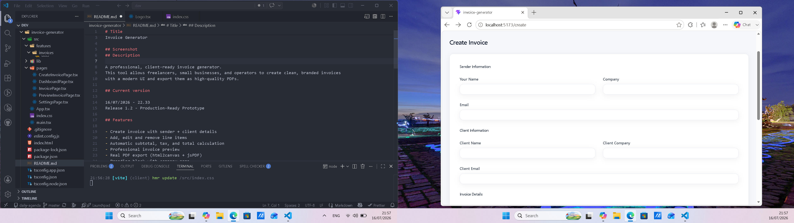

# Title

Invoice Generator

## Screenshot

## Description

A professional, client-ready invoice generator with a full Supababse backend.
Users can create clients, invoices line items, preview invoices and export them as high quality PDFs.

This project is built as a production-ready prototype with complete CRUD operations 
and secure Row Level Security (RLS) policies.

## Current version

22/07/2026 - 22.03
Release 1.3 - Full Backend Integration

## Features

### Frontend
- Create clients
- Create invoices
- Add, edit and remove invoice items
- Automatic subtotal, tax and total calculation
- Professional invoice preview
- PDF export (html"canvas + jsPDF)
- Responsive layout (mobile + desktop)
- Clean spacing and typography

### Backend
- Clients table + CRUD
- Invoices table + CRUD
- Invoice items table + CRUD
- Full Row Level Security
- Policies ensuring users only access their own data
- Secure architecture ready for production

## Tech stack

- React Vite
- Typescript
- CSS3
- html2canvas + jsPDF
- React Router
- Supabase (Postgres + Auth + RLS)

## Bugs (on current commit)

- The frontend doesn't call the CRUD functions

## Future improvements

- Add AI assistant
- Add invoice themes
- Add multi-currency support
- Add invoice history + dashboard
- Add client database
- Add authentication
- Add PDF branding
- Add invoice status tracking

## Changelog 

### 22/07/2026 - 22.03
- Added full Supabase backend
- Added clients CRUD
- Added invoices CRUD
- Added invoices items CRUD
- Added RLS + policies 
- Completed backend integration
- Cleaned up frontend logic

## Author

Yoichi dev